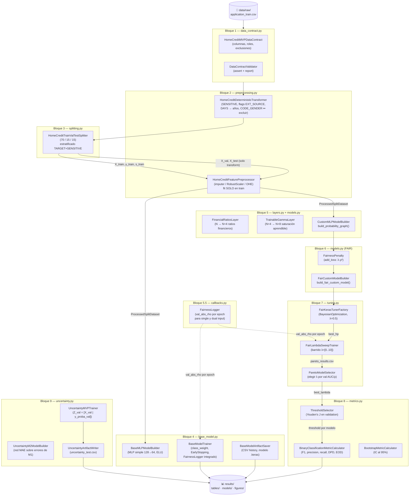

# Documento Maestro de Arquitectura y Handoff Técnico
## Home Credit Default Risk — Redes Confiables: Justicia e Incertidumbre

> **Audiencia:** Equipo técnico del proyecto (máster MIAX-14, Módulo 4)
> **Estado del código:** Bloques 1–9 implementados y con tests. Bloque 10 (OOF) planificado.
> **Última actualización:** Junio 2026

---

## 1. Resumen Ejecutivo

Este proyecto construye un **sistema de scoring de riesgo crediticio confiable** sobre el dataset público de Kaggle *Home Credit Default Risk*. El objetivo es predecir la probabilidad de que un solicitante tenga dificultades de pago (`TARGET=1`) mientras se garantiza que esa predicción sea **matemáticamente justa con respecto al género** del solicitante (`CODE_GENDER`).

El sistema no sólo optimiza precisión predictiva. Incorpora una penalización de **FAIR Loss** basada en la correlación de Pearson al cuadrado entre la predicción y el género, de modo que el modelo no pueda explotar diferencias de género para mejorar su AUC. Adicionalmente, el sistema devuelve junto a cada predicción una **estimación de incertidumbre** —cuánto espera equivocarse el modelo para ese solicitante concreto— lo que permite derivar casos dudosos a revisión humana.

El proyecto está construido con una arquitectura modular estricta: cada bloque de la práctica corresponde a exactamente un módulo Python, cada módulo tiene una única responsabilidad, y todos los artefactos se gestionan con rutas absolutas ancladas al repositorio. Existe una suite de **17 tests automatizados** que protegen los invariantes críticos del pipeline —incluyendo la ausencia de leakage, la alineación de los splits y la exclusión del género como feature normal— y que permiten validar cualquier cambio futuro con un solo comando.

---

## 2. Arquitectura de Alto Nivel y Flujo de Datos

El flujo de datos es estrictamente lineal y unidireccional. El test nunca alimenta ningún paso de ajuste. Cada bloque produce artefactos consumidos por el siguiente.

### 2.1 Diagrama de flujo principal

### 2.2 Separación crítica: qué se ajusta y cuándo

| Paso | Qué se usa para ajustar | Por qué |
|---|---|---|
| `HomeCreditFeaturePreprocessor.fit_transform()` | Solo `X_train` | Previene data leakage estadístico |
| `ClassWeightCalculator` | Solo `y_train` | Los pesos reflejan el desbalance real de train |
| `ThresholdSelector.select()` | Solo `y_val`, `y_proba_val` | El test nunca informa ninguna decisión |
| `M2.fit()` | Errores sobre `Z_val` | M1 no vio validation durante su training |

---

## 3. Desglose de Módulos

### 3.1 `src/data_contract.py` — Bloque 1

**Propósito:** Ser la única fuente de verdad sobre qué columnas, roles y restricciones son válidos para el MVP. Ningún otro módulo define las columnas del dataset; todos las leen desde aquí.

#### Clases principales

| Clase | Responsabilidad |
|---|---|
| **`HomeCreditMVPDataContract`** | Dataclass frozen que enumera identificador (`SK_ID_CURR`), target (`TARGET`), variable sensible (`CODE_GENDER`, codificada como `SENSITIVE`), columnas financieras, temporales, externas y categóricas. Expone `excluded_from_model_columns()` que devuelve las cuatro columnas que jamás deben entrar como features normales. |
| **`DataContractValidator`** | Valida que un DataFrame tenga las columnas requeridas. Modo estricto (rechaza extras) y no-estricto (permite extras). Lanza `DataContractError` si falta algo crítico. |
| **`DataContractReporter`** | Genera un resumen tabular del contrato para auditoría o notebook. |
| **`DatasetFileSpec`** | Value object inmutable que describe un archivo CSV (nombre, rol, `required_for_mvp`, `has_target`). Previene que `application_test.csv` (sin `TARGET`) sea tratado como conjunto evaluable. |
| **`ColumnGroup`** | Agrupa columnas por responsabilidad semántica (financiero, temporal, etc.) para que el builder de ColumnTransformer las procese uniformemente. |

#### Función clave

- **`build_default_home_credit_contract()`** — factory function que instancia el contrato MVP con los valores por defecto. Es el punto de entrada que usan todos los demás módulos para no hardcodear columnas en ningún sitio.

---

### 3.2 `src/preprocessing.py` — Bloque 2

**Propósito:** Transformar el CSV crudo en arrays numéricos sin leakage. El módulo está dividido en dos capas: transformaciones deterministas (sin ajuste estadístico) y preprocessing estadístico (ajustado solo en train).

#### Clases principales

| Clase | Responsabilidad |
|---|---|
| **`HomeCreditDeterministicTransformer`** | Aplica transformaciones que no dependen de distribuciones del dataset: filtra géneros F/M, crea columna `SENSITIVE` (F→0, M→1), crea flags `EXT_SOURCE_*_WAS_MISSING` y `EXT_NULL_COUNT`, maneja el sentinel 365243 en `DAYS_EMPLOYED` (→NaN + flag `DAYS_EMPLOYED_ANOM`), convierte días a años, mapea `FLAG_OWN_CAR` Y/N→0/1, **excluye** `CODE_GENDER`, `SENSITIVE`, `TARGET` y `SK_ID_CURR` del X. |
| **`HomeCreditPreprocessingColumnSpecFactory`** | Crea la especificación del `ColumnTransformer`: columnas financieras (imputer sin scaler), continuas escaladas (imputer + `RobustScaler`), binarias (imputer frecuencia), categóricas (imputer constante + `OneHotEncoder`). Usa `remainder="drop"` para rechazar columnas fuera del MVP. |
| **`HomeCreditFeaturePreprocessor`** | Ensambla el `ColumnTransformer` de sklearn. El método `fit_transform_splits()` fittea **solo en `X_train`** y transforma `X_val` y `X_test` con los parámetros aprendidos. |
| **`HomeCreditMVPPreprocessingPipeline`** | Orchestrator que coordina transformer determinista → splitter → preprocessor estadístico en un flujo único. |
| **`HomeCreditRawDataLoader`** | Carga el CSV usando `usecols=contract.required_raw_columns()` para no cargar en memoria columnas fuera del MVP. |

#### Containers de datos

- **`DeterministicDataset`** — DataFrame de features + Series de target + Series de sensitive, alineados por índice `SK_ID_CURR`.
- **`RawSplitDataset`** — El dataset anterior separado en tres splits, antes del preprocessing estadístico.
- **`ProcessedSplitDataset`** — Arrays numpy `X_train/val/test`, `y_train/val/test`, `s_train/val/test`, lista de `feature_names` y el `preprocessor` ya fiteado.

> **Invariante crítico:** Las columnas financieras (`AMT_INCOME_TOTAL`, `AMT_CREDIT`, `AMT_ANNUITY`, `AMT_GOODS_PRICE`) pasan por el pipeline con **solo imputación de mediana**, sin `RobustScaler`. Esto es intencional: `FinancialRatiosLayer` necesita las magnitudes originales para calcular ratios interpretables.

---

### 3.3 `src/splitting.py` — Bloque 3

**Propósito:** Crear una única partición 70/15/15 reproducible, estratificada por la combinación `TARGET×SENSITIVE`, y auditarla.

#### Clases principales

| Clase | Responsabilidad |
|---|---|
| **`HomeCreditTrainValTestSplitter`** | Ejecuta un split de dos etapas: primero aísla el 15% de test, luego extrae el 15% de validación del 85% restante. La clave de estratificación es `"0_0"`, `"0_1"`, `"1_0"`, `"1_1"` (4 grupos). Garantiza representación de los 4 grupos en los 3 splits. |
| **`StratificationKeyBuilder`** | Construye la clave de estratificación combinando `TARGET` y `SENSITIVE` en una sola columna de string. |
| **`SplitReportBuilder`** | Genera un DataFrame con el tamaño y la distribución de grupos en cada split para auditoría. |
| **`DatasetAlignmentValidator`** | Verifica que `X`, `y` y `s` tengan el mismo número de filas en los tres splits antes de pasar al siguiente bloque. |
| **`SplitIndexExporter`** | Guarda los índices del split en JSON para reproducibilidad independiente del orden de las filas. |

#### Config y resultado

- **`SplitConfig`** — `test_size=0.15`, `validation_size=0.15`, `random_state=42`.
- **`SplitArtifacts`** — Container con `raw_splits: RawSplitDataset`, `report: DataFrame` y `config: SplitConfig`.

---

### 3.4 `src/base_model.py` — Bloque 4

**Propósito:** Construir y entrenar el MLP de referencia (sin FAIR loss, arquitectura simple 128→64) y establecer las utilidades de entrenamiento compartidas por todos los bloques posteriores.

#### Clases principales

| Clase | Responsabilidad |
|---|---|
| **`BaseMLPModelBuilder`** | Construye un MLP con Functional API: Input → Dense(128, ELU) → Dropout → Dense(64, ELU) → Dropout → Dense(1, sigmoid). Compila con Adam(clipnorm=1.0), BCE y métricas AUC/PR-AUC/Accuracy/Precision/Recall. |
| **`BaseModelTrainer`** | Orquesta el entrenamiento: calcula `class_weight` desde `y_train`, construye callbacks (EarlyStopping, ReduceLROnPlateau, `FairnessLogger`), llama a `model.fit()` y retorna `BaseTrainingResult`. |
| **`TrainingCallbackFactory`** | Factory que instancia EarlyStopping y ReduceLROnPlateau desde la configuración. `early_stopping_restore_best_weights` es configurable. |
| **`ClassWeightCalculator`** | Llama a `sklearn.utils.class_weight.compute_class_weight("balanced")` sobre `y_train` exclusivamente. |
| **`AbsolutePearsonCorrelation`** | Calcula `|corr(y_pred, sensitive)|`. Implementación con guard: si `denominator <= eps` devuelve 0.0; de lo contrario divide sin añadir eps de nuevo. |
| **`ReproducibilityManager`** | Setea `PYTHONHASHSEED`, `TF_DETERMINISTIC_OPS`, `tf.random.set_seed`, `np.random.seed` y `random.seed` desde `ReproducibilityConfig`. |
| **`BaseModelArtifactSaver`** | Guarda el history en CSV, las predicciones de validación en CSV y el modelo en `.keras`. Todas las rutas son absolutas via `_PROJECT_ROOT = Path(__file__).resolve().parent.parent`. |
| **`BaseValidationEvaluator`** | Calcula métricas de validación finales: AUC, PR-AUC, F1, accuracy, abs_rho usando el threshold provisional. |

#### Config y artefactos

- **`BaseModelConfig`** — `hidden_units=(128,64)`, `activation="elu"`, `dropout=0.2`, `lr=1e-3`, `clipnorm=1.0`, `batch_size=1024`, `epochs=100`, `early_stopping_patience=10`, `early_stopping_restore_best_weights=True` (configurable), `provisional_threshold=0.5`.
- **`BaseTrainingArtifacts`** — Paths absolutos a `results/tables/base_training_history.csv`, `results/tables/base_val_predictions.csv`, `results/models/base_mlp.keras`.

---

### 3.5 `src/layers.py` — Bloque 5

**Propósito:** Implementar las capas custom de Keras que materializan la "Ruta C": importes financieros originales → ratios → gamma aprendible → normalización → dense stack.

#### Clases principales

| Clase | Responsabilidad |
|---|---|
| **`FinancialRatiosLayer`** | Capa identidad que **añade 4 columnas** al final del tensor: `CREDIT/INCOME`, `ANNUITY/INCOME`, `CREDIT/GOODS`, `ANNUITY/CREDIT`. Opera sobre las columnas financieras sin escalar. Usa `eps=1.0` (en unidades monetarias) y `clip_value=10.0` para estabilizar ratios extremos. Expansión: N → N+4. |
| **`TrainableGammaLayer`** | Capa que **añade 4 columnas** más: aplica a cada ratio la transformación `x^gamma` donde gamma es un parámetro aprendible por columna. Gamma se parametriza como `gamma_min + (gamma_max - gamma_min) * sigmoid(theta)` para garantizar que permanezca en `[0.1, 1.5]`. Expansión: N+4 → N+8. |
| **`FinancialRatioIndexResolver`** | Mapea nombres de columnas de `feature_names` a los índices enteros que necesitan las capas. Valida que las cuatro columnas financieras estén presentes y sean distintas. |
| **`FinancialRatioIndices`** | Dataclass frozen con `idx_credit`, `idx_annuity`, `idx_income`, `idx_goods`. Método `.as_layer_kwargs()` devuelve el dict compatible con el constructor de la capa. Método `.as_tuple()` para validaciones. |

> **Serialización:** Ambas capas están registradas con `@register_keras_serializable(package="HomeCredit")` e implementan `get_config()` completo. Esto garantiza que los modelos guardados en `.keras` puedan cargarse con `tf.keras.models.load_model()` sin código adicional, crítico para el Bloque 11.

---

### 3.6 `src/callbacks.py` — Bloque 5.5

**Propósito:** Proporcionar callbacks de Keras reutilizables para todos los bloques que entrenan modelos, evitando duplicar lógica de monitorización de fairness.

#### Clases principales

| Clase | Responsabilidad |
|---|---|
| **`FairnessLogger`** | Callback de Keras que al final de cada epoch calcula `val_abs_rho = |corr(predicciones_validación, s_val)|` y lo inserta en `logs["val_abs_rho"]`. Compatible con modelos de un input (base) mediante `include_sensitive_input=False` y con modelos de dos inputs (FAIR) mediante `include_sensitive_input=True`. Después de `model.fit()`, `history.history["val_abs_rho"]` contiene la curva completa por epoch. |

#### Parámetros clave de `FairnessLogger`

- `X_val: np.ndarray` — matriz de features de validación.
- `s_val: np.ndarray` — vector sensible 0/1 alineado con `X_val`.
- `include_sensitive_input: bool = False` — keyword-only. `True` para modelos FAIR.
- `batch_size`, `log_name`, `eps` — opcionales con defaults seguros.

---

### 3.7 `src/models.py` — Bloques 5 y 6

**Propósito:** Construir los modelos de Keras con la arquitectura custom (Bloque 5) y con la penalización FAIR (Bloque 6). Es el módulo más importante para la presentación de la práctica.

#### Clases — capa de configuración

| Clase | Responsabilidad |
|---|---|
| **`CustomMLPConfig`** | Config del modelo custom: `hidden_units`, `activation`, `dropout`, `learning_rate`, `gradient_clipnorm`, `ratio_eps`, `ratio_clip_value`, `gamma_min/max`, `theta_init`, `gamma_l2_reg`. Frozen dataclass. |
| **`FairModelConfig`** | Config adicional para el modelo FAIR: `lambda_fair`, `fairness_eps`, `model_name_prefix`, `fairness_layer_name`. Con `lambda_fair=0.0` produce el modelo base final (misma arquitectura que el FAIR, comparación controlada). |

#### Clases — builders

| Clase | Responsabilidad |
|---|---|
| **`CustomMLPModelBuilder`** | Builder del modelo custom. Método `build_from_feature_names()`: recibe `feature_names`, resuelve índices financieros, devuelve `CustomModelBuildResult`. Método `build_probability_graph()`: construye el grafo simbólico hasta sigmoid **sin** envolverlo en `Model` — permite que el Bloque 6 reutilice la arquitectura. Método `compile_model()`: compila con Adam, BCE y métricas AUC/PR-AUC. |
| **`FairCustomModelBuilder`** | Builder del modelo FAIR dual-input. Internamente llama a `CustomMLPModelBuilder.build_probability_graph()`, conecta `FairnessPenalty([prob, sensitive_in])` y construye el `tf.keras.Model` con `inputs={"features": ..., "sensitive": ...}`. Compila con `CustomMLPModelBuilder.compile_model()` para compartir optimizer y métricas con el modelo base. |

#### Clases — capas

| Clase | Responsabilidad |
|---|---|
| **`FairnessPenalty`** | Capa identidad de Keras que añade `lambda_fair * rho²` a la loss mediante `self.add_loss()`. Pasa `y_pred` sin modificarlo como output. El gradiente fluye normalmente hacia el dense stack. Usa `eps` dentro del denominador del sqrt para estabilidad numérica en batches homogéneos. |

#### Containers de resultado

- **`CustomProbabilityGraph`** — Contiene los tensores simbólicos `features_input` y `probability_output` más metadatos de índices. Es la interfaz entre el backbone del Bloque 5 y cualquier envolvente del Bloque 6.
- **`CustomModelBuildResult`** y **`FairModelBuildResult`** — Contienen el modelo compilado, `ratio_indices`, `ratio_feature_indices` y la dimensión de salida del bloque custom.

#### Función utilitaria

- **`build_fair_custom_model(builder, ratio_indices, input_dim, lambda_fair)`** — Factory function de alto nivel. Internamente delega en `FairCustomModelBuilder`. Es el punto de entrada recomendado para los notebooks del Bloque 7.
- **`lambda_slug(lambda_fair)`** — Convierte `0.5` → `"0_5"` para nombres de archivo seguros.

---

### 3.8 `src/tuning.py` — Bloque 7

**Propósito:** Gestionar la búsqueda de arquitectura con Keras Tuner y el barrido controlado de `lambda_fair`, produciendo el CSV Pareto que sirve para elegir el modelo FAIR final.

#### Clases principales

| Clase | Responsabilidad |
|---|---|
| **`FairTunerBuildFunctionFactory`** | Crea la función `build_fn(hp)` que Keras Tuner llama en cada trial. Usa `make_build_fn(builder, ratio_indices, input_dim)` para inyectar dependencias sin variables libres en el closure. Tuner con `lambda_fair=0.5` fijo durante la búsqueda. |
| **`FairKerasTunerFactory`** | Instancia `kt.BayesianOptimization` con `max_trials`, `executions_per_trial` y `directory` configurables desde `TuningConfig`. |
| **`FairKerasTunerRunner`** | Ejecuta `tuner.search()` con los datos duales `{"features": X, "sensitive": s}`, `class_weight` y `FairnessLogger(include_sensitive_input=True)`. |
| **`BestHyperparameterExtractor`** | Extrae los mejores hiperparámetros del tuner y los convierte en un `CustomMLPConfig` listo para usar en el barrido lambda. |
| **`FairLambdaSweepTrainer`** | Entrena un modelo por cada valor de `lambda_values` con la arquitectura ganadora del tuner. Para cada lambda: construye el modelo, entrena, elige threshold con `ThresholdSelector`, calcula métricas de validación y guarda el modelo en `results/models/`. |
| **`ValidationParetoEvaluator`** | Computa las filas del CSV Pareto: `val_auc`, `val_pr_auc`, `val_abs_rho`, `val_f1`, `val_precision`, `val_recall`, `val_threshold`, `epochs_trained`, `model_path`, `history_path`. |
| **`ParetoModelSelector`** | Lee `pareto_results.csv` y selecciona el lambda candidato según criterio de "codo": punto donde reducir `abs_rho` cuesta demasiada AUC. |
| **`DualInputFormatter`** | Utility que formatea `(X, s)` como `{"features": X, "sensitive": s.reshape(-1,1)}` para Keras. Centraliza esta conversión en un solo lugar. |
| **`FairTuningCallbackFactory`** | Crea EarlyStopping, ReduceLROnPlateau y `FairnessLogger` para modelos de dos inputs. |

#### Config y artefactos

- **`TuningConfig`** — `tuning_lambda_fair=0.5`, `lambda_values=[0.0, 0.05, 0.1, 0.25, 0.5, 1.0, 2.0, 5.0, 10.0]`, `max_trials=30`.
- **`TuningArtifactPaths`** — Paths absolutos a `results/tables/pareto_results.csv`, `results/models/fair_lambda_*.keras`, `results/tables/history_fair_lambda_*.csv`.
- **`LambdaSweepResult`** y **`ParetoResultRow`** — Containers de resultados del barrido.

---

### 3.9 `src/metrics.py` — Bloque 8

**Propósito:** Centralizar toda la lógica de evaluación —threshold, métricas binarias, métricas de fairness y bootstrap— para que ningún bloque posterior copie-pegue código de evaluación.

#### Clases principales

| Clase | Responsabilidad |
|---|---|
| **`ThresholdSelector`** | Elige el threshold por Youden's J: `argmax(TPR - FPR)` sobre la curva ROC de validación. Clipea el resultado a `[0, 1]` para evitar thresholds espurios. |
| **`ThresholdApplier`** | Convierte probabilidades en etiquetas binarias dado un threshold. Centraliza la operación `(proba >= threshold).astype(int)`. |
| **`ProbabilityMetricCalculator`** | Calcula métricas que solo necesitan probabilidades: `roc_auc`, `pr_auc`, `abs_rho`. |
| **`BinaryClassificationMetricCalculator`** | Calcula métricas que necesitan etiquetas: `accuracy`, `precision`, `recall`, `f1`. Usa `zero_division=0` en todas las llamadas de sklearn. |
| **`FairnessMetricCalculator`** | Calcula DPD (`demographic_parity_difference`) y EOD (`equalized_odds_difference`) usando `fairlearn.metrics`. Recibe etiquetas binarias, no probabilidades. |
| **`BootstrapMetricCalculator`** | Calcula intervalos de confianza al 95% por bootstrap (n=500, `random_state=42`). Usa wrappers de firma homogénea `(y, proba, s)` para que métricas binarias y de fairness reciban el threshold correctamente. |
| **`MetricInputValidator`** | Valida que `y_true`, `y_proba` y `s` estén alineados y sean válidos antes de calcular cualquier métrica. |

#### Funciones utilitarias

- **`absolute_pearson_correlation(proba, sensitive)`** — Implementación NumPy consistente con `AbsolutePearsonCorrelation` de `base_model.py`.
- **`choose_threshold_youden(y_true, y_proba)`** — Función pura que devuelve el threshold sin estado.
- **`apply_threshold(proba, threshold)`** — Conversión pura de probabilidades a labels.
- **`classification_metrics(...)`** y **`fairness_metrics(...)`** — Funciones de conveniencia que retornan dataclasses `BinaryClassificationMetrics` y `FairnessMetrics`.

#### Containers

- **`ProbabilityMetrics`**, **`BinaryClassificationMetrics`**, **`FairnessMetrics`** — Frozen dataclasses con método `.to_dict(prefix="")` para generar filas de CSVs.
- **`ThresholdSelectionResult`** — Contiene el threshold, su J-score y el índice en la curva ROC.
- **`BootstrapInterval`** — Contiene media, p2.5 y p97.5 de una métrica.

---

### 3.10 `src/uncertainty.py` — Bloque 9

**Propósito:** Estimar cuánto espera equivocarse el modelo principal (M1) mediante un segundo modelo (M2) entrenado para predecir el error absoluto de M1 sobre el conjunto de validación.

#### Clases principales

| Clase | Responsabilidad |
|---|---|
| **`UncertaintyM2ModelBuilder`** | Construye M2: red secuencial de 32 neuronas con activación `relu` en la salida (error absoluto ≥ 0, nunca negativo). Compila con `loss="mae"` y Adam. |
| **`UncertaintyFeatureBuilder`** | Construye la matriz `Z = [X_processed | y_proba]`: concatena las features procesadas con la predicción de M1 como último feature. M2 aprende a predecir el error a partir del contexto completo + la propia predicción de M1. |
| **`UncertaintyInternalSplitter`** | Divide `Z_val` en train y val internos para EarlyStopping de M2. Usa `sklearn.model_selection.train_test_split` con `random_state=42` (no `validation_split` de Keras) para control explícito del seed y tamaño. |
| **`UncertaintyMVPTrainer`** | Orquesta el flujo completo: M1 predice en val → calcula errores absolutos → construye Z_val → divide internamente → entrena M2 → M1 predice en test → M2 predice incertidumbre en test. |
| **`UncertaintyPredictionBuilder`** | Construye el DataFrame final con columnas `SK_ID_CURR`, `y_true`, `y_proba`, `y_pred_label`, `sensitive`, `uncertainty`, `EXT_NULL_COUNT`. |
| **`UncertaintySummaryBuilder`** | Genera `uncertainty_summary_by_target.csv`: mediana e IQR de incertidumbre agrupados por `TARGET` real. |
| **`UncertaintyArtifactWriter`** | Guarda todos los artefactos en `results/tables/` y el modelo M2 en `results/models/uncertainty_m2.keras`. Rutas absolutas. |
| **`DualInputModelPredictor`** | Genera predicciones de M1 (FAIR, dual-input) con el formato correcto `{"features": X, "sensitive": s.reshape(-1,1)}`. |
| **`FairModelLoader`** | Carga un modelo `.keras` con el registro de objetos custom (`FairnessPenalty`, `FinancialRatiosLayer`, `TrainableGammaLayer`). Necesario porque TF no serializa automáticamente capas con `add_loss`. |

#### Config y artefactos

- **`UncertaintyModelConfig`** — `hidden_units=(32,)`, `activation="relu"`, `output_activation="relu"`, `loss="mae"`, `epochs=100`, `internal_validation_size=0.2`, `random_state=42`.
- **`UncertaintyArtifactPaths`** — `results/tables/uncertainty_test.csv`, `results/tables/uncertainty_summary_by_target.csv`, `results/models/uncertainty_m2.keras`.

---

### 3.11 `src/__init__.py` — Paquete público

**Propósito:** Exponer la API pública del paquete `src`. Las importaciones de los Bloques 1–3 (sin TensorFlow) siempre disponibles. Las importaciones de Bloques 4–9 (con TensorFlow) dentro de un bloque `try/except ModuleNotFoundError` para que el paquete pueda instalarse en entornos sin GPU/TF.

---

## 4. Asunciones y Decisiones de Diseño

### 4.1 Asunciones de dominio

| Asunción | Implicación en el código |
|---|---|
| Solo `application_train.csv` en el MVP | `DatasetFileSpec.required_for_mvp = True` solo para ese archivo. Las tablas relacionales (bureau, installments…) no se cargan. |
| Géneros válidos son únicamente `F` y `M` | `HomeCreditDeterministicTransformer` filtra filas con otros valores antes del preprocessing. Filas filtradas se reportan pero no se procesan. |
| `TARGET=1` = dificultad de pago; minoría (~8%) | Se usa `class_weight="balanced"` calculado en train. Loss es BCE pura sin modificar. |
| Las columnas financieras nunca deben escalarse | Pipeline separa `financial_cols` con solo `SimpleImputer(median)`. Las columnas continuas normales van a `continuous_scaled` con `RobustScaler`. |
| `EXT_SOURCE_*` ausente es señal de incertidumbre | Se crean flags `_WAS_MISSING` y la columna `EXT_NULL_COUNT` como features explícitas. |
| El sentinel `365243` en `DAYS_EMPLOYED` significa "no empleado" | Se reemplaza por `NaN` y se crea el flag `DAYS_EMPLOYED_ANOM`. |

### 4.2 Decisiones de diseño de software

**Frozen dataclasses en lugar de dicts.** Todas las configuraciones, contratos y resultados son `@dataclass(frozen=True)`. Esto previene mutaciones accidentales, hace los objetos hashables, y permite que un test compruebe que nadie modificó un resultado después de su creación.

**Separación estricta de responsabilidades por módulo.** Cada archivo `.py` implementa exactamente un bloque. Ningún módulo entrena modelos excepto `base_model.py`, `tuning.py` y `uncertainty.py`. Ningún módulo hace split excepto `splitting.py`. Esto hace que los errores sean fáciles de localizar.

**Rutas absolutas ancladas al repositorio.** Todos los módulos que guardan artefactos usan `_PROJECT_ROOT = Path(__file__).resolve().parent.parent` para construir rutas absolutas. Si un notebook se ejecuta desde `notebooks/`, los CSV van igualmente a `results/tables/`, no a `notebooks/results/tables/`.

**`build_probability_graph()` como contrato de extensión.** El backbone del Bloque 5 se expone como grafo simbólico (no como modelo completo). Esto permite que el Bloque 6 añada `FairnessPenalty` y un segundo input sin duplicar ninguna capa. El builder es la única autoridad sobre la arquitectura.

**`add_loss` en lugar de `y_true_aug`.** La penalización FAIR se añade como término a la función de pérdida mediante `self.add_loss()` en `FairnessPenalty`. Esto preserva `y_true` como vector unidimensional, lo que permite que `class_weight`, `AUC`, `accuracy` y todos los callbacks estándar funcionen sin modificaciones.

**`FairnessLogger` unificado para base y FAIR.** Un solo callback maneja ambos modelos mediante el flag `include_sensitive_input`. Esto evita dos implementaciones de `|rho|` que podrían divergir.

**Lógica de métricas centralizada en `metrics.py`.** Ningún bloque calcula DPD, EOD, AUC o F1 localmente. Todos importan de `src.metrics`. El bootstrap tiene wrappers de firma homogénea para que todas las métricas (con y sin sensitive) se puedan pasar de forma uniforme.

---

## 5. Mapeo entre Teoría y Práctica

### 5.1 Documentos .md → Módulos .py

| Documento de diseño | Módulo implementado | Estado |
|---|---|---|
| `bloque_01_data_contract_mvp.md` | `src/data_contract.py` | ✅ Implementado y testado |
| `bloque_02_preprocesamiento_sin_leakage.md` | `src/preprocessing.py` | ✅ Implementado y testado |
| `bloque_03_split_honesto.md` | `src/splitting.py` | ✅ Implementado y testado |
| `bloque_04_modelo_base.md` | `src/base_model.py` | ✅ Implementado y testado |
| `bloque_05_capas_custom.md` | `src/layers.py` + `src/models.py` (parte) | ✅ Implementado y testado |
| `bloque_05_5_endurecimiento_pre_fair.md` | `src/callbacks.py` + hardening de `base_model.py` + refactor de `models.py` | ✅ Implementado y testado |
| `bloque_06_fair_loss_profesional.md` | `src/models.py` (`FairnessPenalty`, `FairCustomModelBuilder`, `FairModelConfig`) | ✅ Implementado |
| `bloque_07_keras_tuner_y_barrido_lambda.md` | `src/tuning.py` | ✅ Implementado |
| `bloque_08_threshold_decision.md` | `src/metrics.py` | ✅ Implementado y testado |
| `bloque_09_incertidumbre_mvp.md` | `src/uncertainty.py` | ✅ Implementado |
| `bloque_10_incertidumbre_oof_extra.md` | *(sin módulo propio aún)* | 📋 Planificado |
| `bloque_11_evaluacion_final.md` | Usa `src/metrics.py` + predict de `src/models.py` | 🔲 Pendiente de notebook |
| `bloque_12_figuras_obligatorias.md` | Usa artefactos CSV de todos los bloques | 🔲 Pendiente de notebook |

### 5.2 Conceptos teóricos → Implementación concreta

| Concepto teórico | Dónde vive en el código |
|---|---|
| **Demographic Parity** como objetivo de justicia | `FairnessPenalty.call()` → `self.add_loss(lambda_fair * rho²)` |
| **ρ² en lugar de ρ** para evitar correlación negativa perfecta | `FairnessPenalty`: `self.add_loss(lambda_fair * tf.square(rho))` |
| **Ruta C**: importes → ratios → gamma | `FinancialRatiosLayer` (N→N+4) + `TrainableGammaLayer` (N+4→N+8) en `layers.py` |
| **Gamma acotado** via sigmoid parametrización | `TrainableGammaLayer`: `gamma = gamma_min + (gamma_max-gamma_min) * sigmoid(theta)` |
| **CODE_GENDER no entra como feature** | `HomeCreditDeterministicTransformer._split_features_target_sensitive()` + `DataContract.excluded_from_model_columns()` |
| **Columnas financieras sin escalar** | `HomeCreditPreprocessingColumnSpecFactory`: financiero → solo `SimpleImputer`, sin `RobustScaler` |
| **Split estratificado TARGET×SENSITIVE** | `StratificationKeyBuilder` + `HomeCreditTrainValTestSplitter` con `stratify=strata_key` |
| **Threshold en validation, no en test** | `ThresholdSelector` en `metrics.py` + política documentada en `TuningArtifactPaths` |
| **M1→M2 para incertidumbre** | `UncertaintyMVPTrainer`: M1 predice en val, M2 aprende `|y_proba - y_true|`, M2 predice en test |
| **EXT_NULL_COUNT como proxy de incertidumbre** | Flag creado en `HomeCreditDeterministicTransformer` e incluido en `uncertainty_test.csv` |
| **lambda_fair=0 como base controlada** | `FairModelConfig(lambda_fair=0.0)` produce arquitectura idéntica al FAIR sin penalización activa |

---

## 6. Próximos Pasos

### 6.1 Ejecución del pipeline (prioridad inmediata)

Los CSV de Kaggle deben descargarse en `data/raw/` antes de ejecutar el pipeline completo. Una vez disponibles:

1. **Ejecutar el pipeline Bloques 1–5** en un notebook de orquestación para obtener `ProcessedSplitDataset`.
2. **Ejecutar el Bloque 7** (tuning + barrido lambda) para generar `pareto_results.csv`.
3. **Seleccionar el modelo FAIR** desde `pareto_results.csv` con `ParetoModelSelector`.
4. **Ejecutar el Bloque 9** para obtener `uncertainty_test.csv`.

### 6.2 Bloque 10 — Incertidumbre OOF (mejora metodológica)

El módulo `src/uncertainty.py` cubre el MVP (Bloque 9). El Bloque 10 requiere un módulo adicional (o extensión de `uncertainty.py`) con:

- `StratifiedKFold(n_splits=5, shuffle=True, random_state=42)` estratificado por `TARGET×SENSITIVE`.
- Loop de entrenamiento OOF que use `build_fair_custom_model()` con los mejores hiperparámetros.
- `X_trainval_processed = np.vstack([X_train_processed, X_val_processed])` documentado explícitamente (sin leakage porque el scaler solo vio `X_train`).
- Callbacks por fold: EarlyStopping + ReduceLROnPlateau. Sin `FairnessLogger` (los modelos de fold son temporales).

### 6.3 Bloques 11 y 12 — Evaluación y figuras (notebooks)

Estos bloques no requieren nuevos módulos en `src/`; consumen lo ya implementado:

- **Bloque 11:** Llamar a `BinaryClassificationMetricCalculator`, `FairnessMetricCalculator` y `BootstrapMetricCalculator` desde `src.metrics` para construir `test_results.csv`. Usar paths de `TuningArtifactPaths` para cargar los modelos guardados.
- **Bloque 12:** Todas las figuras deben usar `_PROJECT_ROOT / "results/tables/..."` para leer CSVs y `_PROJECT_ROOT / "results/figures/..."` para guardar PNGs. Corregir `hue="y_true"` en seaborn mapeando a strings. Usar doble eje Y o normalización para comparar loss curves base vs. FAIR.

### 6.4 Tests pendientes

Los módulos `src/tuning.py` y `src/uncertainty.py` disponen de archivos de tests (`tests/test_tuning.py`, `tests/test_uncertainty.py`, `tests/test_metrics.py`, `tests/test_fair_model.py`) pero conviene verificar que cubren los invariantes críticos equivalentes a los de los módulos ya testados:

- Test de que `FairnessPenalty` no modifica el output (es identidad).
- Test de que el threshold siempre se elige en validation y no se filtra al test.
- Test de que M2 no recibe datos de test durante su entrenamiento.

### 6.5 Correcciones menores en los docs de diseño

Antes de codificar los Bloques 10–12, los documentos `.md` correspondientes tienen inconsistencias menores ya identificadas que deben corregirse primero (ver análisis de revisión previa). Los más importantes: paths relativos en Bloque 12, convención de nombres de history CSVs y clarificación del modelo "base" en la tabla final del Bloque 11.

---

*Documento generado desde el estado actual de `src/` y `docs/`. Refleja los archivos Python del repositorio a Junio 2026.*
